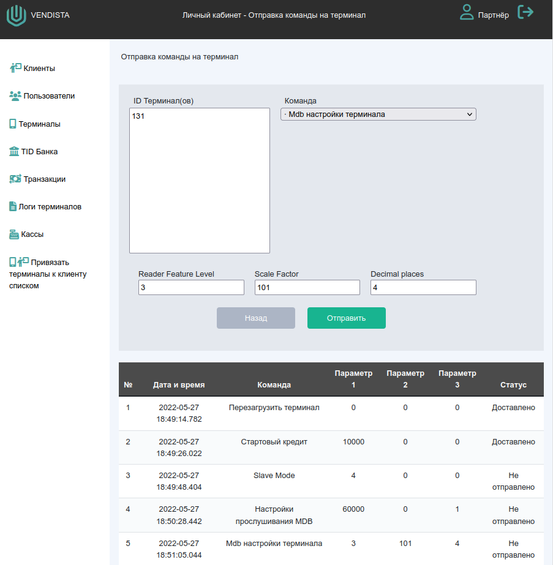

### Отправка команды на терминал

Открывается страница, где вверху можно ввести номер терминала, выбрать команду для отправки (выбор из списка) и параметр 1- 3 (целое число). Кнопка “Отправить”. 
Ниже - таблица с ранее отправленными командами:
* Дата и время отправки
* Команда
* Параметр 1-3 (только значения)
* Статус (отправка в процессе, доставлено, не доставлено)

Данное приложение использует кросс-доменные запросы (CORS), поэтому сервер WebAPI должен их разрешать.

Использование:

Вариант 1. Скачать каталог программы и запустить в браузере файл _Static/index.html_. 
Если кросс-доменные запросы блокируются браузером, то следует исрользовать Вариант 2.

Вариант 2. В консоли перейти в каталог программы и запустить _dotnet run_ (в системе должен быть установлен .NET SDK 6)
В адресной строке браузера ввести _http://localhost:5000/_.

